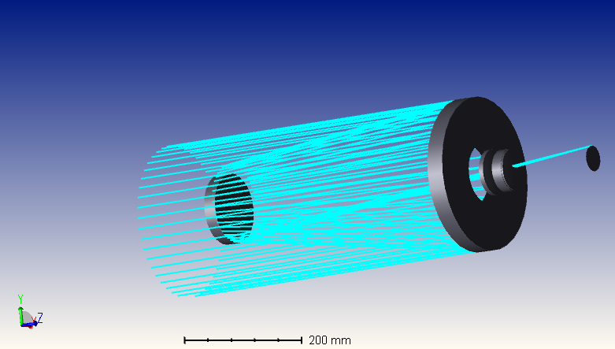
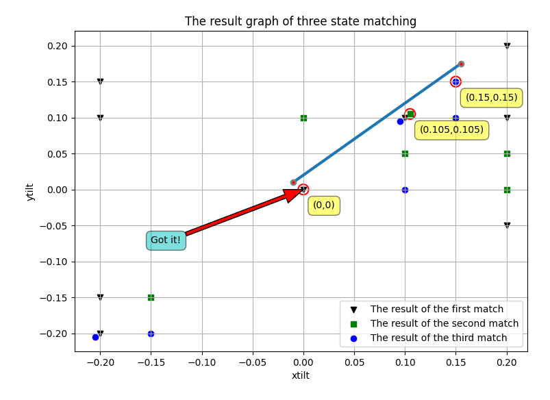

# Digital_Twin
借助数字孪生技术实现光学系统状态感知
 

<table width="100%" border="0" cellspacing="0" cellpadding="0">
  <tr>
    <td align="center"> </td>
  </tr>
  <tr>
    <td align="center">Fig.1 The 3D model of the telescope.</td>
  </tr>

  

<table width="100%" border="0" cellspacing="0" cellpadding="0">
  <tr>
    <td align="center"></td>
  </tr>
  <tr>
    <td align="center">Fig.2 Telescope misalignment state perception results.</td>
  </tr>

